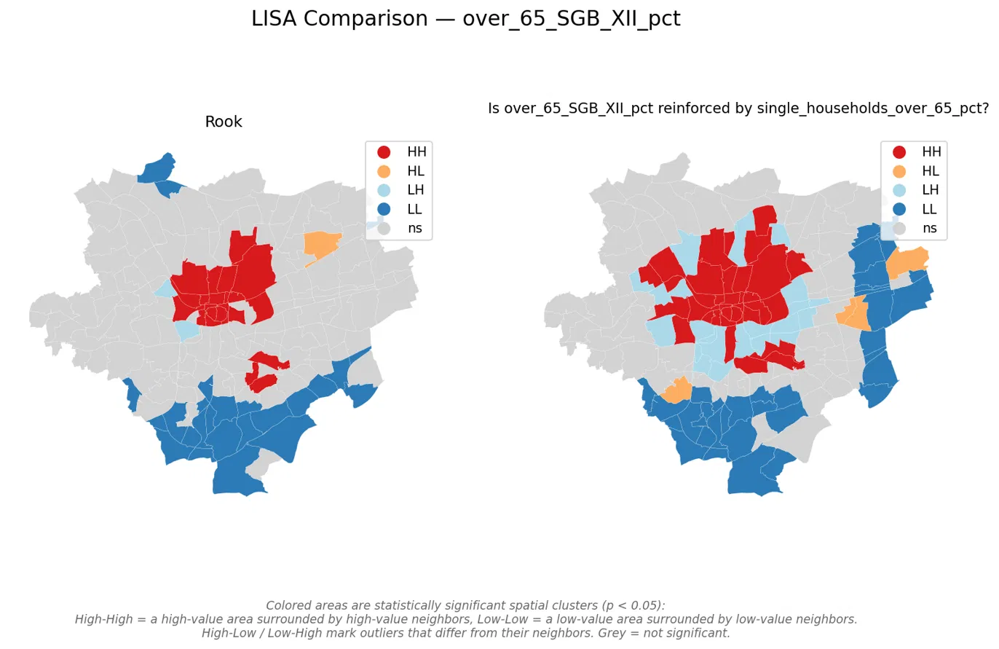
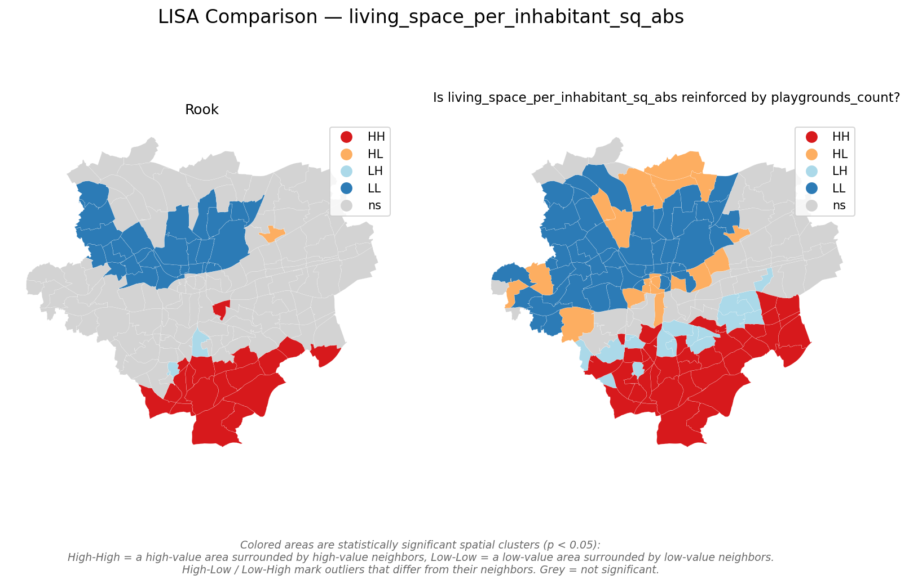
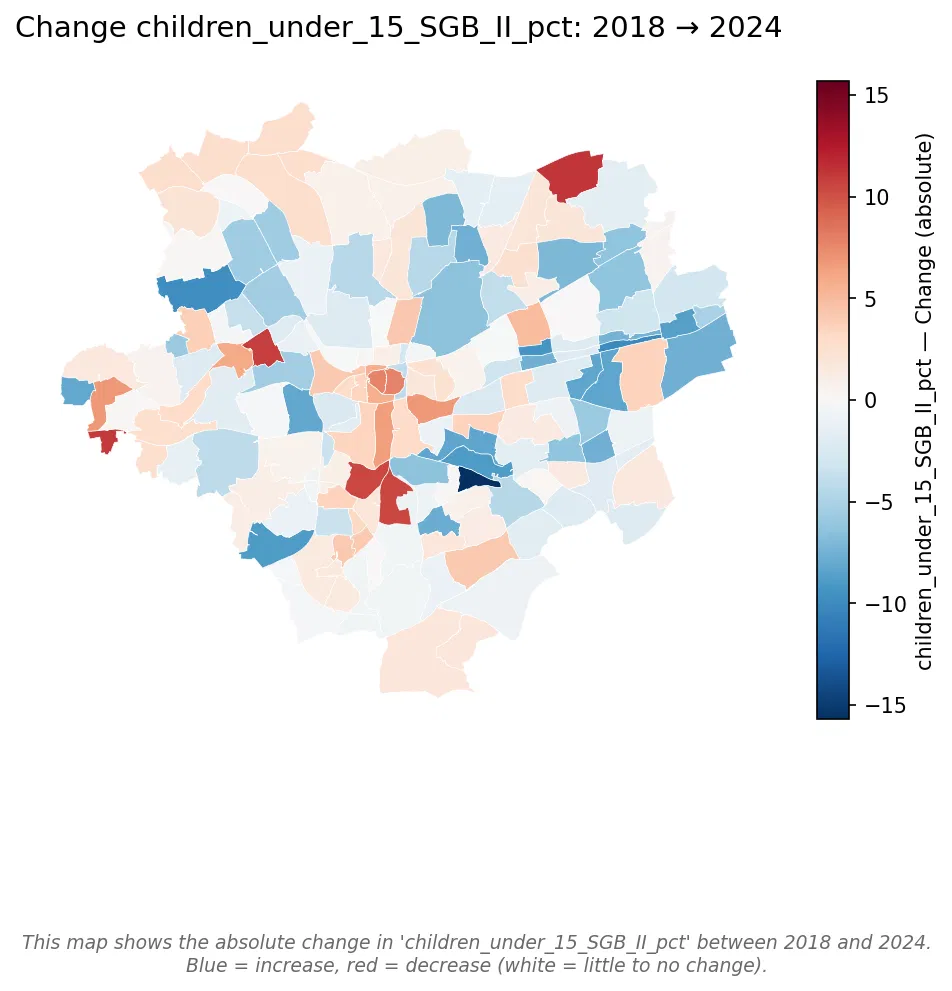
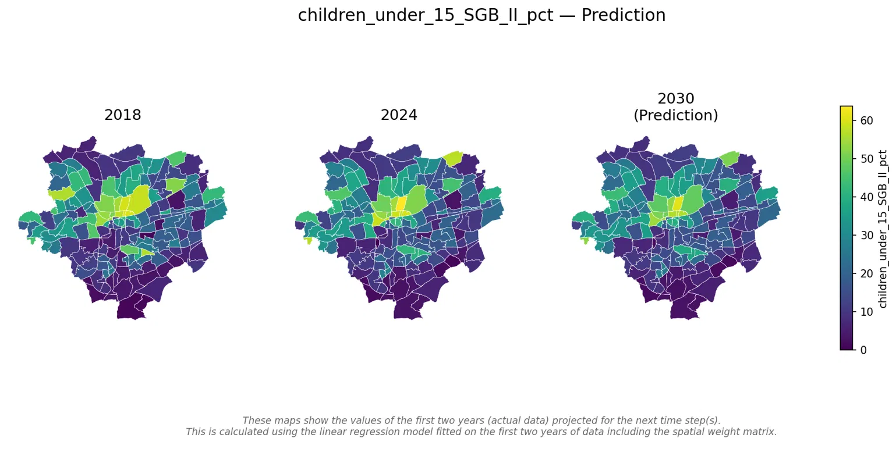
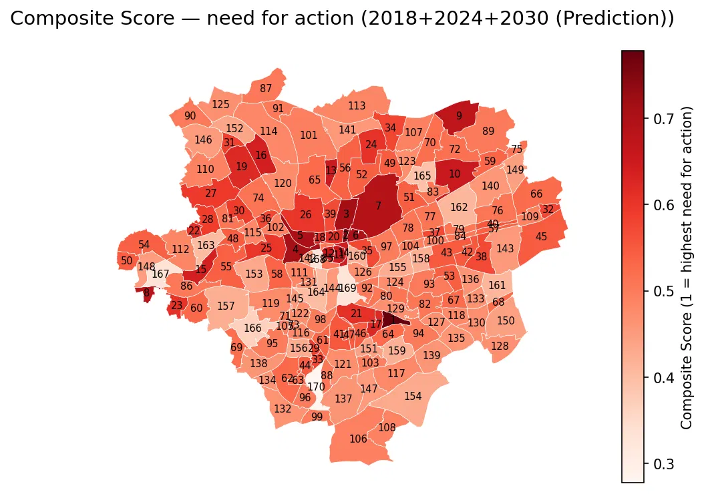
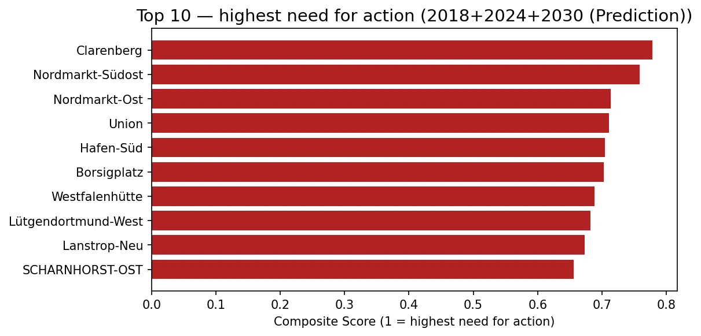

# SpatialJustice

Our project for the course _Spatial Justice and Support Decision Systems_.

## Authors

Anke Nienaber, Lea Heming, Julia Ilchmann

## Table of Contents

- [Motivation](#motivation)
- [Justice Concept](#justice-concept)
- [Project Idea and Goals](#project-idea-and-goals)
- [Analytical Solution](#analytical-solution)
- [Data Sources](#data-sources)
- [Project Structure](#project-structure)
- [Quickstart](#quickstart)
- [Flags and Methods](#flags-and-methods)
  - [Correlation](#correlation)
  - [Predict](#predict)
  - [Score](#score)
- [Our Results](#our-results)
  - [Correlation: Elderly Poverty and Living Alone](#correlation-elderly-poverty-and-living-alone)
  - [Correlation: Living Space and Playgrounds](#correlation-living-space-and-playgrounds)
  - [Prediction: Child Poverty 2018 → 2024 → 2030](#prediction-child-poverty-2018--2024--2030)
  - [Score: Elder Vulnerability and Child Poverty](#score-elder-vulnerability-and-child-poverty)
- [Functional, Technical, and Non-Functional Requirements](#functional-technical-and-non-functional-requirements)
- [License](#license)
- [References](#references)

## Motivation

Societies and cities are constantly changing and evolving due to factors such as migration, economic developments, and political decisions. While many working-age adults have the financial resources, mobility, and freedom to adapt to these changes by moving within a city or relocating elsewhere, not all population groups have the same opportunities.

Children and older people are particularly affected, as they often have a stronger dependence on their immediate surroundings and fewer possibilities to overcome spatial disadvantages on their own. Safe, accessible, and supportive environments are therefore essential for their participation, well-being, and quality of life.

As societies continue to age and the needs of younger generations shape the future of cities, ensuring spatial justice becomes increasingly important. Cities need to understand and address the different requirements of their residents to create fair living conditions across all districts.

## Justice Concept

Our support decision system is based on two Justice Concepts.

First, **John Rawls' Theory of Justice (1971)** [1] says that social and economic inequalities is only justified, if they bring the greatest benefit to the least advantaged people of our society. A fair equality of opportunity is already ensured.

Also **Iris Marion Young in Justice and the Politics of Difference (1990)** [2] says that it is not good to think from justice only in a distributive kind of manner, so just asking who owns how much (number of daycares, care facilities per district). This does not show the structures and processes that create this distribution.

Our Composite Index shows where there is inequality in the infrastructure, not how it happened. The ranking is meant to help make decisions based on the idea that the most disadvantaged areas should be prioritised. This project does not look at the reasons for this.

## Project Idea and Goals

We want to design a decision support system for the city of Dortmund. Certain factors determine and contribute to inequalities in vulnerable groups. We analyse these factors to develop a support decision system where social stress might occur, giving the opportunity to recognize need for political decision actions in Dortmund's districts to reduce inequality and provide equal opportunities.
For a just city.

That's why we include socioeconomic factors from all 170 districts of Dortmund as well as the number of facilities (e.g. kindergartens, day care) in each district.
The following image shows our preliminary questions that will be analyzed with our Spatial Decision Support system which includes a spatial weight matrix.
For each question we plan to create a district ranking (e.g. top ten) to identify districts for the specific question and to find out if there are districts which seem to be inequal across multiple indicators.

## Analytical Solution

In the following, our approach to solve the above stated problems is described step-by-step.

## Data Sources

The social factors for Dortmund are taken from the

- [Statistikatlas Dortmund - 2018](https://www.dortmund.de/dortmund/projekte/rathaus/verwaltung/dortmunder-statistik/downloads/215_-_statistikatlas_-_2019.pdf)

- [Statistikatlas Dortmund - 2024](https://statistikportal.dortmund.de/#subpage_statistikatlas)

The Point data is from the [Open Data Portal Dortmund](https://open-data.dortmund.de/pages/start/)

The healthcare facilities are retrevied from OSM

## Project Structure

```
sj-explorer/
├── .venv
├── data
├── reports
├── preprocessing
|   └── output
├── src/sj
|   ├── __pycache__
|   ├── weights
|   |    ├── __init__.py
|   |    ├── contiguity.py
|   |    ├── distance.py
|   |    └── socioeconomic.py
|   ├── analysis.py
|   ├── composite.py
|   ├── io.py
|   ├── main.py
|   ├── points.py
|   ├── prediction.py
|   ├── report.py
|   ├── scoring.py
|   └── viz.py
├── pyproject.toml
├── requirements.md
└── README.md
```

## Quickstart

**Prerequisites:** [uv](https://docs.astral.sh/uv/) must be installed.

```bash
# Clone the repository
git clone https://github.com/anienabe/SpatialJustice

# Navigate to the frontend
cd sj-explorer

# Run the correlation app
uv run sj correlation

# Run with point data as socioeconomic OR analysis variable
# required: example.geojson in data folder
# required: analysis_variable OR socioeconomic_variable
# as analysis variable
uv run sj correlation -v "example_count" -s "socioeconomic_variable" -p "example" -w "rook" -w "socio"

# as socioeconomic variable
uv run sj correlation -v "analysis_variable" -s "example_count" -p "example" -w "rook" -w "socio"

# Run the prediction app
uv run sj predict

# Run the scoring app
uv run sj score
```

### Data preprocessing

As a first step, the geodata with the boundaries of each of Dortmund's Unterbezirke (sub-districts) needs to be downloaded and converted to a GeoJSON. All the needed statistical information of social factors have to be converted from plain text in a pdf (year 2018) to a csv format. This can then be joined with the boundaries into a larger file, which is subsequently converted into a GeoJSON format.

As a second step, the same data categories were collected, extracted and put in a csv. The data has to undergo some changes due to the aggregation of administrative districts over the period. After that, it was then joined with the administrative boundaries and converted into a GeoJSON format.

## Flags and Methods

In this section the input, processing and output for each app.command (correlation, predict, score) are explained.

### Correlation

We have multiple variables in our GeoJSON and want to know how the spatial justice is correlated between the neighbouring districts. For this we can select one variable (analysis variable) and calculate the Global Moran's I to see how the phenomena (analysis variable) is clustered across the whole study area. Another possibility is to calculate the Local Moran's I to see local clusters. For this, we can either select just the analysis variable or an additional reinforcing variable (socioeconomic variable).

A point dataset can also be given as input (that will be transformed in the background into a socioeconomic or analysis variable) to find out if the points have a reinforcing effect on our defined analysis variable.

**Input**

| Flag | Explanation                                              | Example             | Note                                                                                                                  |
| ---- | -------------------------------------------------------- | ------------------- | --------------------------------------------------------------------------------------------------------------------- |
| -i   | GeoJSON input file                                       | do_data2018.geojson | must be in data folder                                                                                                |
| -v   | Analysis variable for Moran's I calculation              | average_age_years   | can be added by "+"                                                                                                   |
| -s   | Reinforcing variable for socioeconomic spatial weighting | deaths_per_1000_abs | can be added by "+"                                                                                                   |
| -d   | Distance threshold                                       | 5000                | if distance band is used as weight                                                                                    |
| -w   | Weight for spatial weight matrix                         | rook                | can be used multiple times (maps side by side)                                                                        |
| -p   | Name of point layer                                      | playgrounds         | name must be filename without .geojson, can be added by "+", must be used with example+\_count as socioeconomic index |

**Processing**

- load geojson file
- if point data input given:
  - `count_points_in_boundaries` from points.py
  - used counted points data column as socio index variable
- if multiple analysis or socio variables given with "+" in input
  - combine the two values per each district into one as analysis_variable or socio_index
- build spatial weight matrix
  - `create_rook_swm` and `create_queen_swm` (from contiguity.py)
  - `create_distance_swm` and `create_knn_swm` (from distance.py)
- if socio index given as input
  - distance band is used to create swm
  - `create_socio_swm` (from socioeconomic.py) based on distance band
- `build_morans_table` (from analysis.py)
- `print_morans_table` and `save_morans_table` (from report.py)
- `plot_swm_weighted` (from viz.py) for map with thin and thick lines
- `compute_local_morans`(from analysis.py)
- `plot_lisa_comparison`(from viz.py) for maps with all inputted weights

**Output**

All output files are in reports folder.

- global Moran's I Comparison in console and .csv file
- swm map with thin and thick lines for given input weights as .png files
- LISA comparison map as .png file

### Predict

We have found two datasets from two years with almost the same variables. Therefore it would be an perfect opportunity, to use this data to predict the trend of each district, based on the change of those two years. With the computation of a spatial lag for each district using the spatial weight matrix, a weighted average of the indicator across all neighbouring districts can be represented. Those valuable calculations can then be used for plotting change maps and integration into our composite score.
So if you found data for two years, use it to get trends for multiple steps into the future.

**Input**

| Flag | Explanation                                             | Example             | Note                                            |
| ---- | ------------------------------------------------------- | ------------------- | ----------------------------------------------- |
| -f1  | GeoJSOn input file for earlier year                     | do_data2018.gejson  | still works with swapped years, but it is wrong |
| -f2  | GeoJSOn input file for second year                      | do_data2024.geojson | still works with swapped years, but it is wrong |
| -y1  | Year label for earlier year                             | 2018                | for titles display                              |
| -y2  | Year label for second year                              | 2024                | for titles display                              |
| -v   | Socioeconomic indicator to predict                      | share_65_80_pct     | X                                               |
| -i   | Column name to join both years                          | unbeznr             | needs to be the same in both files              |
| -n   | Column for district name                                | bezeichnun          | for display                                     |
| -w   | Weight for spatial weight matrix to predict spatial lag | rook                | X                                               |
| -d   | Distance threshold                                      | 5000                | if distance band is used as weight              |
| -s   | How often model is applied recursively                  | 1                   | how many times predict in the future            |

**Processing**

- load two geojson files
- `merge_two_years`(from prediction.py) into a new gdf
- build spatial weight matrix
  - `create_rook_swm` and `create_queen_swm` (from contiguity.py)
  - `create_distance_swm` and `create_knn_swm` (from distance.py)
- `build_prediction_table`
  - uses given indicator, the swm based on given weight and given steps to calculate residuals and projection
- Root Mean Squared Error and Mean Absolute Error are calculated with `rmse`and `mae`(from prediction.py)
- `plot_prediction_map` with visualization of year 1, year 2 and projected year (from viz.py)
- `plot_change_map` with visualization of change from year 1 to year 2 (from viz.py)

[3] **Formula:**
A linear regression model is fitted with two predictors:

>)

The model predicts each district's value at t2 from two inputs: its own past value (β₁) and the average of its neighbours' past values (β₂ · lag). The intercept β₀ captures the baseline shift.

**Output**

All output files are in reports folder.

- R square, RMSE and MAE value in console
- table of actual values from year 1 to year 2 and projected years in console and saved as .csv file
- side-by-side prediction map as .png file
- change map as .png file

### Score

For our decision support system we need to streamline all of our different functionalities into one meaningful otput.
We combined our ideas from correlation and predict into one composite score to find out the districts with the highest need for action. This is shown in a ranking with a composite score.
It can be interesting to find out more for the current situation, include the historical change and the predicted future trend in a full scope analysis.

**Input**

| Flag | Explanation                                                         | Example                                        | Note                                                                                                                  |
| ---- | ------------------------------------------------------------------- | ---------------------------------------------- | --------------------------------------------------------------------------------------------------------------------- |
| -ind | Normalization, lower values worse or higher values worse selectable | living_space_per_inhabitant_sq_abs:lower:worse | Repeat is possible; these variables are ranked (no correlation or causality)                                          |
| -sc  | Years to use in analyses                                            | current                                        | latest dataset, historical dataset, projection into future possible                                                   |
| -f1  | GeoJSOn input file for earlier year                                 | do_data2018.gejson                             | only for scope historical and full                                                                                    |
| -f2  | GeoJSOn input file for second year                                  | do_data2024.geojson                            | X                                                                                                                     |
| -y1  | Year label for earlier year                                         | 2018                                           | for titles display                                                                                                    |
| -y2  | Year label for second year                                          | 2024                                           | for titles display                                                                                                    |
| -yf  | Year label for projection                                           | 2030                                           | for titles display                                                                                                    |
| -i   | Column name to join both years                                      | unbeznr                                        | needs to be the same in both files                                                                                    |
| -n   | Column for district name                                            | bezeichnun                                     | for display                                                                                                           |
| -p   | Name of point layer                                                 | playgrounds                                    | name must be filename without .geojson, can be added by "+", must be used with example+\_count as socioeconomic index |
| -w   | Spatial weight matrix for future projection                         | rook                                           | only for scope full                                                                                                   |
| -d   | Distance threshold                                                  | 5000                                           | if distance band is used as weight                                                                                    |
| -s   | How often model is applied recursively                              | 1                                              | only for scope full                                                                                                   |
| -wp  | Relative weight for the past score                                  | 1.0                                            | only for scope historical and full; if 1.0 at wp, wc, wf, then all weighted equally                                   |
| -wc  | Relative weight for the current score                               | 1.0                                            | if 1.0 at wp, wc, wf, then all weighted equally                                                                       |
| -wf  | Relative weight for the projected future score                      | 1.0                                            | if 1.0 at wp, wc, wf, then all weighted equally                                                                       |
| -tn  | How many districts dislayed in ranking barchart                     | 10                                             | X                                                                                                                     |
| -l   | Name for output file                                                | composite                                      | X                                                                                                                     |

**Processing**

- `parse_indicators` (in composite.py)
  - direction for normalization (higher worse or lower worse)
- load one or two geojson files (if scope historical or full)
- if points input:
  - `count_points_in_boundaries` (from points.py)
  - used counted points data column as socio index variable
- if scope is full:
  - `merge_two_years` (from prediction.py)
  - build spatial weight matrix
    - `create_rook_swm` and `create_queen_swm` (from contiguity.py)
    - `create_distance_swm` and `create_knn_swm` (from distance.py)
- `build_multi_year_score` (from scoring.py)
  - always score current year
    - uses only `score_single_year` to get composite score (`build_composite_score`)
  - if scope is historical:
    - additionally score earlier year as with current year
  - if scope is full:
    - additionally score earlier year and prediction
    - use `project_indicators_to_future` and `build_composite_score` for prediciton
  - weighted sum of all included year scores
- `print_ranking` and `save_ranking` (from report.py)
- flag districts that are consistently disadvantaged `flag_consistent_disadvantaged` (from composite.py)
- `plot_composite_map` and `plot_ranking` (from viz.py) with maps for composite score and ranking

**Output**

All output files are in reports folder.

- Composite Score Ranking table in console and saved as .csv file (scope current, past, future, final and rank)
- districts flagged as top-n worst in multiple indicators in console and saved as .csv file
- composite score map and score ranking map saved as .png files

## Our Results

### Correlation: Elderly Poverty and Living Alone

Do districts with elderly poverty also have more people living alone?

```bash
uv run sj correlation -v "over_65_SGB_XII_pct" -s "single_households_over_65_pct" -w "rook" -w "socio"
```



The rook map shows HH-clusters of elderly poverty in the city centre and north, with LL-clusters in the south. When weighted by single-household rate, the HH-cluster in the centre grows and extends, suggesting that elderly poverty and living alone spatially reinforce each other: where one is high, the other tends to be too. So, the two factors cluster together, particularly in the centre of Dortmund.

### Correlation: Living Space and Playgrounds

Do districts with less living space per inhabitant also have fewer playgrounds?

```bash
uv run sj correlation -v "living_space_per_inhabitant_sq_abs" -s "playgrounds_count" -p "playgrounds" -w "rook" -w "socio"
```



The rook LISA map shows that low living space clusters in the north and northwest, while the south has significantly more space per person. When switching to the socio-weighted SWM, weighted by playground density, the Low-Low cluster in the north grows noticeably. This means that districts with little living space tend to also have fewer playgrounds nearby, pointing to a spatial double disadvantage.

### Prediction: Child Poverty 2018 → 2024 → 2030

How does child poverty change over the years and what does the prediction show?

```bash
uv run sj predict -v "children_under_15_SGB_II_pct"
```




The change map shows that child poverty mostly decreased across Dortmund between 2018 and 2024, but a few districts in the north and centre actually increased. The prediction map shows the pattern staying largely stable into 2030, the high-poverty cluster in the north remains. With an R² of 0.922, the model confirms that child poverty is structurally persistent: where it was high in 2018, it tends to still be high in 2024 and likely in 2030.

### Score: Elder Vulnerability and Child Poverty

Which districts face the highest need for action across both vulnerable groups?

```bash
uv run sj score -ind "children_under_15_SGB_II_pct:higher_worse" -ind "living_space_per_inhabitant_sq_abs:lower_worse" -ind "over_65_SGB_XII_pct:higher_worse" -ind "single_households_over_65_pct:higher_worse" --scope full -w rook
```




The score combines child poverty, elderly poverty, single elderly households, playground count and senior daycare across three time points. Clarenberg leads the ranking (0.78), followed by Nordmarkt-Südost and Nordmarkt-Ost. The map shows the highest need for action concentrated in the north and city centre. Union is flagged in four out of five indicators simultaneously (child poverty, elderly poverty, single elderly households and missing senior daycare) pointing to structural multidimensional deprivation.

**Limitations:** The `single_households_over_65_pct` prediction has an R² of 0.002, so the 2030 projection for this indicator is not meaningful. With only 26 senior daycare facilities city-wide, most districts have zero, making this indicator less useful for differentiation between districts.

**Our Decision Support**
Our composite score aimes to find the most precarious districts of Dortmund for children and elderly people as they are part of the society but often lack possibilities and face spatial disadvantages.

The result consistently points to the same districts across all dimensions: the Nordmarkt area, Union, Borsigplatz, Hafen-Süd and Clarenberg face the highest need for action for both children and elderly people. Union is the only district flagged in four out of five indicators simultaneously, making it the clearest priority.

Following Rawls, these are exactly the districts that should be prioritized: not because they have one isolated problem, but because deprivation compounds there across poverty, living space and infrastructure. Following Young, this analysis shows the distribution, not why it exists. But knowing where the need is greatest is the necessary first step for policy action.

## Functional, Technical, and Non-Functional Requirements

See [Requirements](sj-explorer/requirements.md) for more details.

## License

This project is licensed under the [MIT License](LICENSE).

## References

[1] Rawls, J. (1971). A theory of justice (Rev. ed.). Harvard University Press.

[2] Young, I. M. (1990). Justice and the politics of difference. Princeton University Press.
